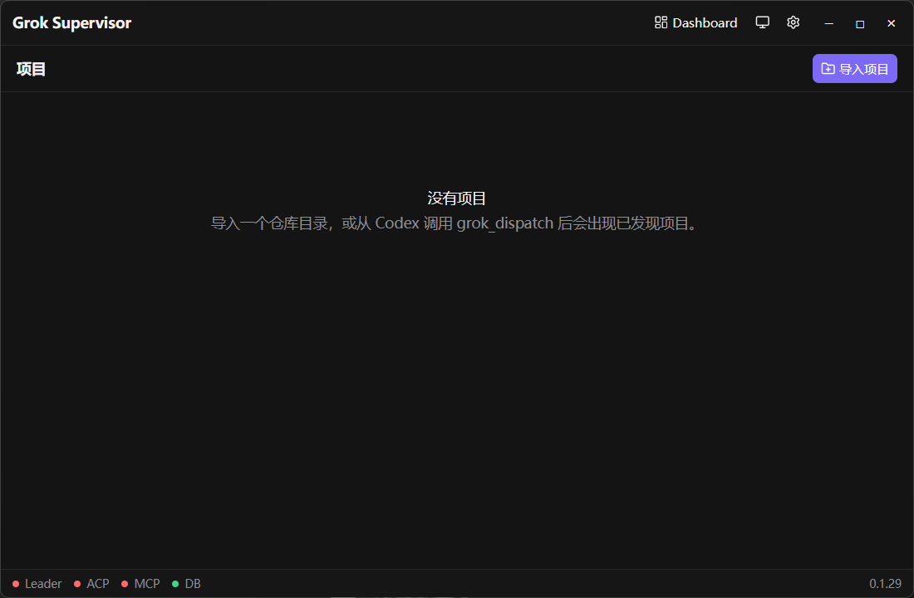

# Grok Supervisor

这是放在电脑上的一个小窗口，用来盯着本机的 Grok 干活。

Codex 可以把查代码、改代码、跑测试这类活交给 Grok。这个窗口负责记住任务，方案需要你拍板时递过来，你想看 Grok 的终端时再打开。平时任务在后台跑，不会一打开就弹出一堆终端。

窗口标题是 **Grok Supervisor**，程序文件名是 `GrokMcp`。

## 先准备好

- Mac 要 macOS 15 或更新；Windows 要 64 位。
- 本机要有已登录的 Grok 命令行，版本至少 1.0.34。还没装的话，打开本程序，进「设置」，点「运行诊断」，按提示装到用户目录 `~/.grok/bin`，不需要管理员。登录命令是 `grok login`。
- 要让 Codex 派活，还需要 Codex。接法在下面「接到 Codex」。

Windows 的界面用系统里的 [WebView2 Runtime](https://developer.microsoft.com/microsoft-edge/webview2/)。Windows 11 通常已经带了。

## 安装

到 [Releases](https://github.com/shusfun/GrokMcp/releases) 下载对应文件：

| 文件 | 用在 |
| --- | --- |
| `GrokMcp-*-darwin-amd64.dmg` | Mac Intel |
| `GrokMcp-*-darwin-arm64.dmg` | Mac Apple 芯片 |
| `GrokMcp-*-windows-amd64-installer.exe` | Windows 安装包 |
| `GrokMcp-*-windows-amd64.zip` | Windows 绿色版，解压就能跑 |

同一页有 `SHA256SUMS.txt`，用来核对文件没有下错。Mac 和 Linux：

```sh
shasum -a 256 -c SHA256SUMS.txt
```

Windows 可以这样看某个文件的值，再和清单里同一行对一下：

```powershell
certutil -hashfile .\你下载的文件名 SHA256
```

### Mac

安装包没有做 Apple 公证，第一次打开会被系统拦住。把「Grok Supervisor」拖进「应用程序」。被拦之后，到「系统设置 → 隐私与安全性」点「仍要打开」。也可以在终端执行：

```sh
xattr -cr "/Applications/Grok Supervisor.app"
```

磁盘镜像里的 `打开说明.txt` 和 `清除隔离属性.command` 做的是同一件事：去掉下载带来的隔离标记。

### Windows

运行安装包会装到当前用户的程序目录，一般是 `%LOCALAPPDATA%\Programs\Grok Supervisor`，并放上开始菜单和桌面快捷方式。再运行一次安装包，会在原来的目录里升级，并先关掉正在运行的窗口。任务数据不在安装目录里，升级后还在。

绿色版解压后直接运行 `GrokMcp.exe`。程序里的「检查更新」下载的是 zip，不会把安装包拿来覆盖正在用的程序。

## 日常怎么用

打开后先是项目列表。还没有项目时是这样：



底部的 Leader、ACP、MCP 在还没派活、Codex 也还没接上时是红的。数据库正常时 DB 是绿的。这是刚打开的正常样子。

1. 打开 Grok Supervisor。这一步只开窗口，不会去连 Grok，也不会把上次没做完的任务自动接着跑。
2. 按下面的说明，把 MCP 接到 Codex。两条路选一条。
3. 在首页点「导入项目」，选你的仓库。默认会放一份工具说明：`.agents/skills/grok-supervisor-tools/SKILL.md`。这个位置如果已经有你自己的文件，不会覆盖，项目照样登记。
4. 在 Codex 里正常下指令，让它把活交给 Grok。Codex 派过任务的目录也会出现在首页，标成「已发现」；你手动导入的标成「已导入」。
5. 回到这个窗口看任务。要看终端就点「显示 TUI」。方案出来了，点「批准」「退回」或「取消任务」。

点窗口的关闭，程序会缩进托盘，任务还在。要真正退出，用托盘菜单里的「退出」。还有任务在跑，或正在等你输入时，会先问你要不要留在托盘。退出不会删掉 Grok 的会话。

托盘里可以打开主窗口、打开 Grok Dashboard，也能看到有几个任务在干活、几个在等你。窗口标题栏上也有 Dashboard。

进项目之后有三个页签：

- **任务**：这个仓库里的任务列表。
- **提示词**：生成一段给 Codex 复制的话。它只进剪贴板，不会自动发出去。
- **设置**：打开仓库目录，安装、更新或移除那份工具说明。不想再把它当作已导入项目时，点「降为已发现」。源码、历史任务、Grok 会话和说明文件都还在。

任务上常用的按钮：

- **显示 TUI**：打开这个任务的 Grok 终端。同一个任务再打开，还是原来那个窗口。关掉终端，或点「转为无头」，任务继续在后台跑。
- **继续**：程序重启后，没做完的任务会显示「待手动恢复」。点继续会载入原来的会话。
- **批准 / 退回 / 取消任务**：方案准备好之后在这里拍板。

暂时没有要跑的任务、没有排队、没有开着的查看窗口，也没有还连着的待审批会话时，大约 30 秒后会放开后台的 Grok 连接。下次派活或点继续时再连。连 Grok 的握手大约等 15 秒，超时后这次连接失败，需要你再点继续或重新派活。

Codex 那边的 MCP 断开后，这边已经在跑的任务还会留着。如果本程序没开，Codex 一调用，可能会把窗口拉起来；窗口拉起来之后，仍然要等真正派活，才会去连 Grok。

Windows 上，这个程序用自己的连接，放在数据目录里的 `grok-leader.sock`。你在终端里已经开着的 Grok 不会被它抢走。

## 接到 Codex

打开「设置 → 集成 / MCP 配置」。服务器名字固定是 `grok_supervisor`，中间不能有空格。旧名字 `Grok Supervisor` 在 Codex 桌面里加载不了。换成新名字之后，到 Codex 的 MCP Servers 里重启一次。

**你用 CC-Switch 管理 MCP 时：** 点「用 CC-Switch 快速导入」。这个按钮只打开 CC-Switch 的导入链接，要你在 CC-Switch 里确认。它不会把配置写进 CC-Switch 的数据库，也不会改模型设置。确认之后，回到这里点「重新检测」。如果还留着旧的 `Grok Supervisor` 那一行，删掉它。

CC-Switch 里已经有同名配置、只是内容旧了的时候，导入链接改不了原来的内容。复制更新 JSON，打开 CC-Switch，在 MCP 编辑页粘贴，再回来重新检测。

**你不用 CC-Switch 时：** 点「添加/更新到 Codex」。已经加过时，按钮会写成「更新到 Codex」。它调用已安装的 `codex mcp add`，不改模型、服务商或登录信息。也可以自己复制命令或 TOML。已有配置带了超时或环境变量时，程序不会自动删掉再加，以免把你写过的配置冲掉。

也可以只把配置打印出来，自己粘贴。这条命令不写文件，也不改模型设置：

```sh
# Mac：必须是包里面的可执行文件，不是 .app 本身
"/Applications/Grok Supervisor.app/Contents/MacOS/GrokMcp" mcp-config

# Windows：安装目录或解压目录里的 exe
GrokMcp.exe mcp-config
```

Windows 上打印出来的添加命令按 PowerShell 加了引号。你如果不是在 PowerShell 里粘贴，用它同时打印出来的 TOML。Codex 实际启动的是 `GrokMcp.exe mcp`。

检查本机通不通。这条命令不会把自己变成主程序，也不恢复任务：

```sh
GrokMcp doctor
```

它会打印程序路径、建议的 MCP 命令、本机服务是否在听，以及 Grok 的路径、版本和登录状态。检查版本和登录时会运行 `grok version` 和 `grok models`，不会去启动 leader。

## 设置和数据

外观（跟随系统、浅色、深色）改完立刻生效。别的项要点保存。

- **Grok 二进制**：留空就自动找。
- **终端**：用平台默认就行。自定义模板可以用 `{command}`、`{cwd}`、`{session_id}`。Windows 上查看窗口要求模板里正好有一次 `{command}`。旧写法 `{grok} --resume {session_id}` 会在运行时换成这条查看命令，保存的原文不动；换成之后如果还留着 `{grok}`，这次打开会被拒绝。
- **调试模式**：默认关。打开后可以记脱敏过的内容，用来排查，不会默认塞给 Codex。
- **运行诊断**：要点一下才执行。启动时不会自动诊断。
- **检查更新**：在「关于」里，对着 [GitHub Releases](https://github.com/shusfun/GrokMcp/releases) 看有没有新版本。

数据放在：

| 系统 | 目录 |
| --- | --- |
| Windows | `%APPDATA%\GrokSupervisor` |
| Mac | `~/Library/Application Support/GrokSupervisor` |
| 自己编译的其他系统 | `~/.local/share/GrokSupervisor` |

里面有 `supervisor.db` 和日志。想换地方，启动前设置环境变量 `GROK_SUPERVISOR_HOME`。

## 自己编译

需要 Go 1.27 和 pnpm。

```sh
pnpm install
pnpm build
go test ./...
sh scripts/dev.sh
```

`scripts/dev.sh` 会编译前端和 `./bin/GrokMcp`，然后打开桌面窗口。仓库里的 `go.env` 把模块代理指到 `goproxy.cn`。这个脚本和打包脚本在本机都会用它。

打安装包：

```sh
sh scripts/package.sh
```

Mac 安装包只能在 Mac 上打，要用系统的磁盘镜像和签名工具。Windows 包是不带控制台窗口的图形程序，zip 文件名类似 `GrokMcp-<版本>-windows-amd64.zip`。不传版本时，打包脚本用 `0.1.0`。

## 发版的人看这里

发布流水线先出草稿。Windows 的安装包给用户安装用，应用内更新用同版本的 zip，不会把安装包选成就地替换的程序文件。CI 会拿 v0.1.22 的载荷做一次隔离安装，再验证原位升级后数据还在，并且再装一次时不启动 app。

草稿要转成正式版之前，必须做一次受控的、单实例的真实 Windows Grok 检查：用专用 socket，能交互接入，执行过程中关掉再打开查看窗口，并且没有未经请求就冒出来的可见终端。Fake ACP 和 ConPTY fixture 测试不能代替这次真实检查。已经发出去的 Release 不要覆盖，标签也不要强行挪走。更新你自己电脑上的安装，和把版本公开发布，是两件事。
